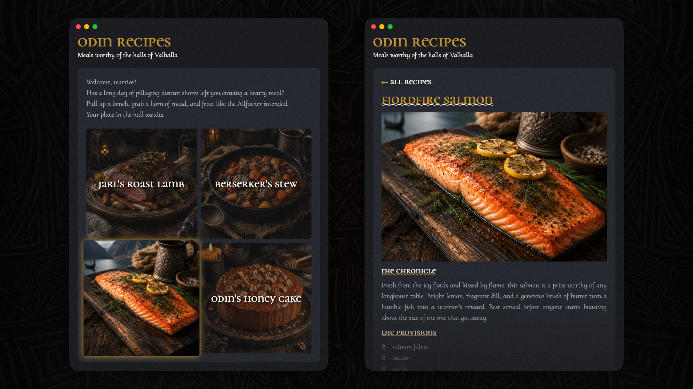

# Odin Recipes

A small, multi-page website built to practise the fundamentals of HTML and CSS.

#### [Live Preview](https://turingtvpi.github.io/odin-recipes/)

## Acknowledgements

Created as part of **[The Odin Project Foundations](https://www.theodinproject.com/paths/foundations/courses/foundations)** course.

### Typography

- [Cormorant Unicase](https://fonts.google.com/specimen/Cormorant+Unicase) by Christian Thalmann
- [Cormorant Upright](https://fonts.google.com/specimen/Cormorant+Upright) by Christian Thalmann

### Icons

- [Font Awesome Free v7.3.0](https://fontawesome.com/) by Fonticons, Inc.
- [Noto Sans Runic](https://fonts.google.com/specimen/Noto+Sans+Runic) by Google

### Images

- Recipe photography generated with [ChatGPT](https://chatgpt.com/).

### Development

- Built with HTML5 and CSS3 using [JetBrains WebStorm](https://www.jetbrains.com/webstorm/).

### CSS Reset

- CSS reset provided by [modern-normalize](https://github.com/sindresorhus/modern-normalize), by Sindre Sorhus, Jonathan Neal, and Nicolas Gallagher.

## What I Learned

Through this project I practised:

- Writing semantic HTML
- Handcrafting CSS
- Structuring a multi-page website
- Working with relative paths
- Building layouts with CSS Grid and Flexbox
- Creating reusable CSS components
- Developing a consistent visual identity
- Using pseudo-elements and custom styling
- Improving accessibility with meaningful HTML and alt text

## Disclaimer

This website is a fictional educational project created for learning purposes. It is not affiliated with The Odin Project, Google, Font Awesome, JetBrains, or any other organisations acknowledged above.